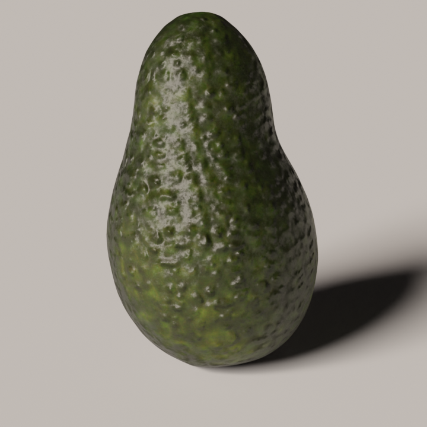
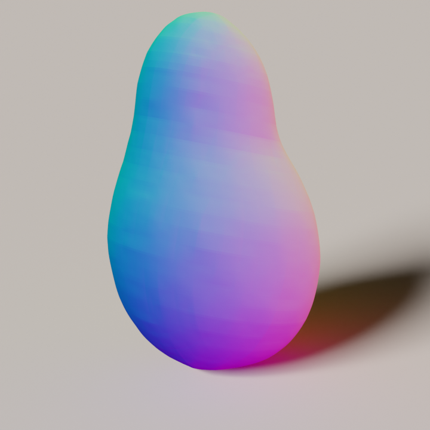
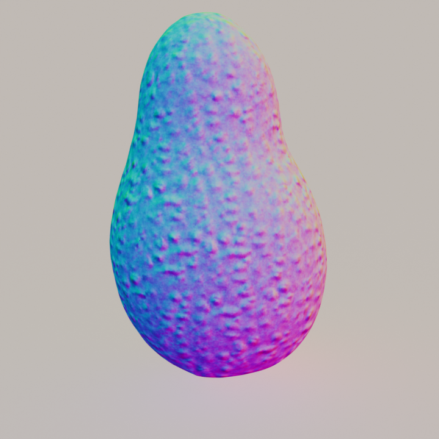
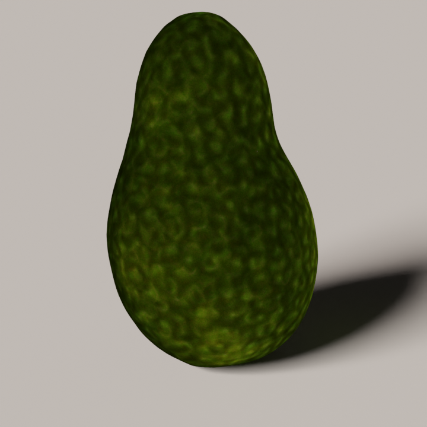

# Blender Render Toolkit


A Python-based toolkit for rendering high-quality images and videos of 3D objects using Blender, specifically designed for research projects.

<p align="center">


</p>

## Features

- Simple command-line interface for headless rendering
- GPU-accelerated rendering with CUDA support
- Easy integration with research pipelines

## Requirements

### Hardware

- CUDA-compatible GPU
- Sufficient GPU memory for rendering

### Software

- Python >= 3.10
- Blender >= 4.0 (via bpy)

### Installation

```bash
pip install bpy
```

## Usage

### 1. Render an object with albedo and normal uv maps

Check `examples/avocado` for an example input data including a base mesh, an albedo uv map, and a normal uv map.

#### Full Color Rendering

```bash
# Render a 360° rotating video (x-rotation: 75°)
CUDA_VISIBLE_DEVICES=0 python blender_obj_uv_normal.py --data_path ./examples/avocado --start_rot_x 75 --rotate_video

# Use ffmpeg to convert images to a video
ffmpeg -y -i output/avocado_full_color_rotate/%4d.png -c:v libx264 -r 30 -pix_fmt yuv420p output/avocado_full_color_rotate.mp4
```

> **Note**: Remove the `--rotate_video` flag to render a single frame instead of a video sequence.

<p align="center">


</p>

#### Normal Map Rendering

```bash
# Render a 360° rotating video (x-rotation: 75°)
CUDA_VISIBLE_DEVICES=0 python blender_obj_uv_normal.py --data_path ./examples/avocado --start_rot_x 75 --rotate_video --texture_type normal

# Use ffmpeg to convert images to a video
ffmpeg -y -i output/avocado_normal_rotate/%4d.png -c:v libx264 -r 30 -pix_fmt yuv420p output/avocado_normal_rotate.mp4
```

> **Note**: Remove the `--rotate_video` flag to render a single frame instead of a video sequence.

<p align="center">


</p>

> **Note**: Add `--normal_map "None"` flag to render the base geometry normal without tactile textures

<p align="center">


</p>

> **Note**: Add `--disable_shadow` flag to render without the casted shadow

<p align="center">

</p>

#### Albedo Map Rendering

```bash
# Render a 360° rotating video (x-rotation: 75°)
CUDA_VISIBLE_DEVICES=0 python blender_obj_uv_normal.py --data_path ./examples/avocado --start_rot_x 75 --rotate_video --texture_type albedo

# Use ffmpeg to convert images to a video
ffmpeg -y -i  output/avocado_albedo_rotate/%4d.png -c:v libx264 -r 30 -pix_fmt yuv420p output/avocado_albedo_rotate.mp4
```

> **Note**: Remove the `--rotate_video` flag to render a single frame instead of a video sequence.

<p align="center">


</p>

### 2. After rendering rotating views, create a video to visualize two modalities side by side with swiping effect

Example usage:

```bash
CUDA_VISIBLE_DEVICES=0 python swipe_window_freeze.py --obj_name avocado
ffmpeg -y -i  output/avocado_combined_swipe/%4d.png -c:v libx264 -r 30 -pix_fmt yuv420p output/avocado_combined_swipe.mp4
```

<p align="center">

</p>

### 3. Batch process multiple object meshes

Example usage:

```bash
bash scripts/batch_blender.sh
```

> **Note**:

- remove `--start_rot_x 75` or set to other appropriate rotation angles for different meshes
- update `data_path` when necessary

## Featured Projects

Projects that have successfully used this toolkit:

- [FlashTex](https://flashtex.github.io/)
- [TactileDreamFusion](https://github.com/RuihanGao/TactileDreamFusion/tree/main?tab=readme-ov-file)

## References and related works

- [BlenderToolBox](https://github.com/HTDerekLiu/BlenderToolbox)
- [Blender-cli-rendering](https://github.com/yuki-koyama/blender-cli-rendering)
- [kiuikit](https://github.com/ashawkey/kiuikit)

## Contributing

We welcome contributions! Please feel free to submit a Pull Request.

## License

This project is licensed under the MIT License.
